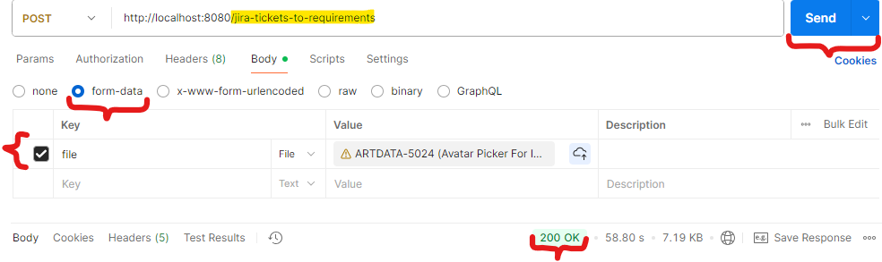

# AI Agent, which transforms Jira ticket(s) description to requirements

This project provides AI-powered assistant (agent), capable to generate holistic well-defined, structured requirements for provided Jira tickets' descriptions.

## High-level agent Overview
- this genAi assistant exposes REST endpoint `/jira-tickets-to-requirements`, expecting `form-data` CSV file, exported from Jira containing related Jira tickets.
- the CSV file (which can be obtained via export from Jira) should contain **at least the following columns**: 
  - `Summary`, `Issue key`, `Issue Type`, `Description`
- due certain customer infrastructure limitations this genAi agent currently expects related tickets in form of CSV file, exported from Jira. In future, once there's possibility to call Jira REST api programmatically, the genAI assistant could be extended to search for related Jira tickets using the "{*}Related Tickets{*}: {keyword1, keywordN}" inscription and appropriate keywords within the ticket description (or using e.g. same **Component** and **labels** etc).
- target Foundation Model is configurable, currently these FMs are supported:
  - gpt-4o
  - gemini-2.5-pro
- the `gemini-2.5-pro` Foundation Model seems produces results of **better quality**
## Getting Started
1. Update your Jira and AI (LLM) API keys in `application.yaml`.
2. Run `./gradlew bootRun` to start the service.
3. Sample command to capture your local IP address:
    `ipconfig /all | find "IPv4 Address"`
4. Sample request:
   ```bash
   curl -X POST "http://localhost:8080/jira-tickets-to-requirements" -H "Accept: application/json"  -F "file=@/path/to/jira_tickets.csv"
   ```

## Sample Postman request:


## Notes
- Built with Java 21, Spring Boot, and Gradle

Feel free to open an issue or submit a pull request!